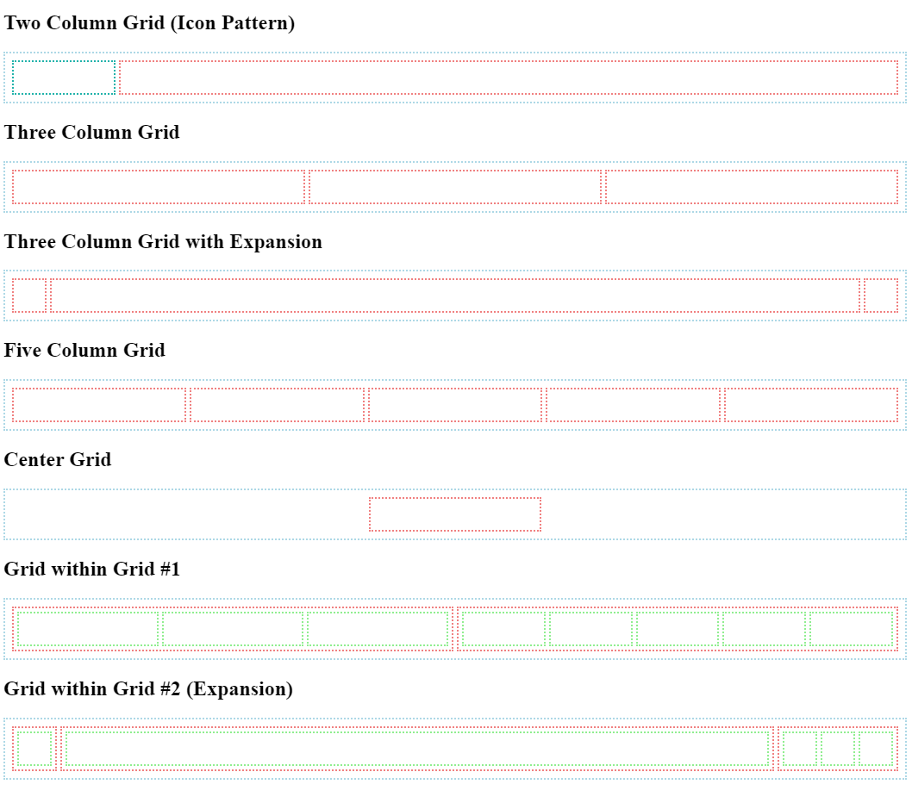

# Grid Components
In this exercise, we're going to spend more time with CSS grid implementing specific layouts to really nail down our Grid skills.

## Instructions
The `index.html` file in this repoistory contains place holder sections for you to implement different layouts. Take this file and implement Grid layouts in each section according to the requirements defined by the heading.

The end result should achieve layouts that look like so:

## Tips
- Again, work with little coloured blocks using div tags and align them using grid.
- Use div tags to create your blocks give them coloured borders to be able to see them more clearly, while you are trying to line them up.